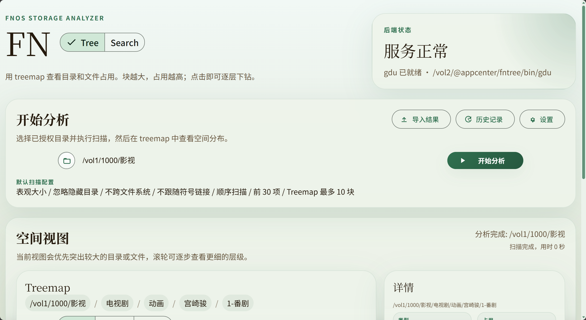

# FN Tree

> fnOS 上的磁盘占用分析与文件搜索应用。  
> 一个应用里同时提供 Tree、Treemap、索引搜索、实时搜索和统一设置页。

## 项目简介

FN Tree 面向 fnOS / NAS 场景，解决两类常见问题：

- 哪些目录和文件最占空间
- 某个文件到底在哪个授权目录里

当前应用包含三个核心页面：

- `Tree`：执行扫描，查看目录层级、子项列表和 treemap
- `Search`：在授权目录范围内做快速搜索和实时搜索
- `Settings`：统一管理扫描配置、搜索索引配置、主题色和明暗模式

## 功能特性

- 支持对已授权目录执行空间分析
- 支持 treemap 可视化查看目录 / 文件占用
- 支持历史任务记录、结果导出、路径复制
- 支持快速搜索（索引）和实时搜索（fd / fdfind）
- 支持按文件 / 文件夹过滤搜索结果
- 支持按匹配顺序、名称、大小、时间排序，并可切换升序 / 降序
- 支持点击搜索结果中的目录继续查看目录内容
- 支持结果面包屑回退
- 支持统一设置页管理扫描与搜索行为
- 支持主题色切换
- 支持浅色、深色、跟随系统三种明暗模式
- 支持在搜索框里用范围前缀缩小搜索范围

搜索范围前缀：

- `@photos cat`
  - 在当前选中的授权目录下的 `photos` 子目录内搜索 `cat`
- `/vol1/1000/Dev/photos cat`
  - 在指定绝对路径目录内搜索 `cat`
  - 该路径必须仍然位于授权目录范围内

## 页面预览

### Tree



### Treemap Detail


### Search


## 项目结构

```text
FNTree-
├─ .official/
│  └─ fntree/                 # 实际应用源码与打包目录
│     ├─ app/
│     │  ├─ server/           # Node.js 后端
│     │  ├─ ui/               # 前端页面、样式、脚本
│     │  └─ bin/              # gdu / fd 等二进制
│     └─ manifest             # fnpack 清单
├─ docs/                      # 截图和设计参考
├─ scripts/                   # 辅助脚本
└─ fntree_*.fpk               # 根目录测试安装包产物
```

重点目录：

- `.official/fntree/app/ui/index.html`
  - Tree + Search 主页面
- `.official/fntree/app/ui/settings.html`
  - 设置页
- `.official/fntree/app/ui/styles.css`
  - 全局样式
- `.official/fntree/app/ui/app.js`
  - Tree 页面逻辑
- `.official/fntree/app/ui/search.js`
  - Search 页面逻辑
- `.official/fntree/app/ui/theme.js`
  - 主题色与明暗模式逻辑
- `.official/fntree/app/server/server.js`
  - 后端 API 与搜索 / 分析服务

## 技术栈

- Frontend: 原生 HTML / CSS / JavaScript
- UI: [mdui](https://www.mdui.org/)
- Backend: Node.js
- Disk usage: `gdu`
- Search: `fd` / `fdfind`
- Packaging: `fnpack`

## 运行依赖

- fnOS 应用运行环境
- Node.js 22
- Linux 版 `gdu`
- Linux 版 `fd` 或 `fdfind`
- `fnpack.exe` 打包工具

## 本地开发

源码主目录：

```text
F:\FNTree-\.official\fntree
```

常改动的位置：

- 前端页面：`.official/fntree/app/ui`
- 后端服务：`.official/fntree/app/server`
- 清单版本：`.official/fntree/manifest`

建议开发流程：

1. 修改前端或后端代码
2. 用 `node --check` 检查相关 JS 文件
3. 在 `.official/fntree` 下执行打包
4. 将 `fntree.fpk` 复制为根目录版本化安装包
5. 解包核对包内文件后再安装到 fnOS

## 打包

在 PowerShell 中进入应用目录：

```powershell
Set-Location F:\FNTree-\.official\fntree
& F:\FNTree-\.tooling\fnpack.exe build
```

打包成功后会生成：

```text
F:\FNTree-\.official\fntree\fntree.fpk
```

测试安装包通常会复制到仓库根目录，命名格式为：

```text
F:\FNTree-\fntree_x.y.z_official_fnpack.fpk
```

注意：

- fnOS 只允许安装更高版本号的程序
- 每次生成可安装包前，都需要先递增 `.official/fntree/manifest` 里的 `version`

## 使用说明

### Tree

1. 选择一个已授权目录
2. 点击“开始分析”
3. 查看 treemap、详情卡片和当前层级子项

### Search

1. 选择搜索范围
2. 选择“快速搜索”或“实时搜索”
3. 输入关键词，或直接输入范围前缀后继续搜索
4. 使用筛选、排序、面包屑和详情面板查看结果

### Settings

可配置内容包括：

- 主题色
- 明暗模式
- 扫描统计方式
- 前 N 项显示数量
- Treemap 最大显示块数
- 搜索索引周期
- 参与索引的授权目录

## 仓库说明

- 主分支是 `master`，不是 `main`
- 根目录下的 `fntree_*.fpk` 一般是测试安装包，不属于源码
- `.gitignore` 已排除常见打包和验证产物

## 免责声明

本项目当前以可用性和迭代效率为优先，代码与 UI 经历了多轮 AI 协作修改。  
如果你要继续维护，建议先从以下文件开始熟悉：

- `.official/fntree/app/ui/index.html`
- `.official/fntree/app/ui/styles.css`
- `.official/fntree/app/ui/app.js`
- `.official/fntree/app/ui/search.js`
- `.official/fntree/app/ui/settings.js`
- `.official/fntree/app/ui/theme.js`
- `.official/fntree/app/server/server.js`
